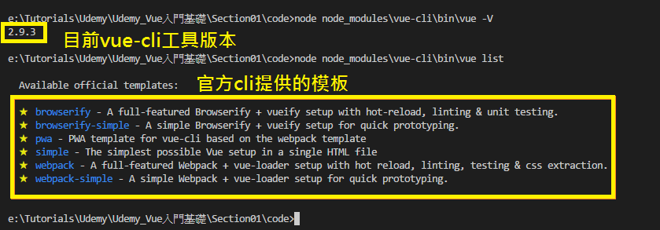
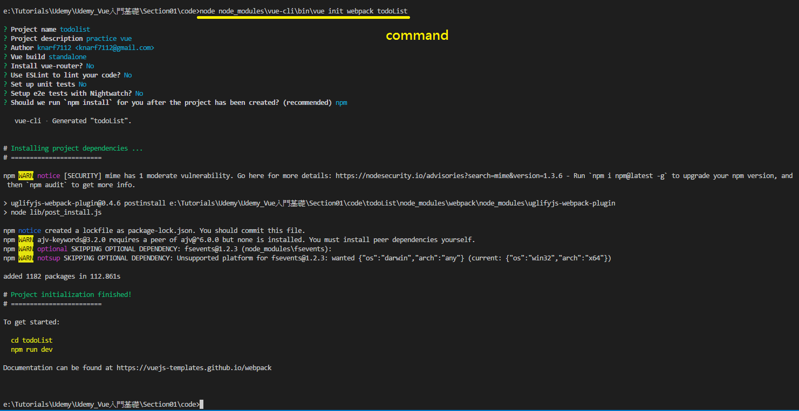
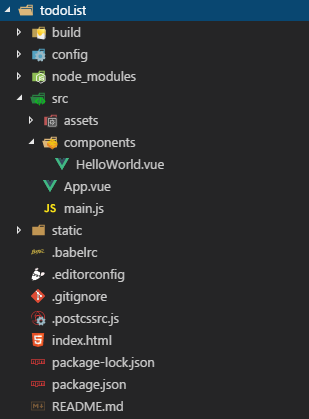

# Vue 課程簡介以及框架介紹

## 課程介紹
1. 初步了解Vue.js框架(MVVM框架)
2. 介紹vue.js開發環境的搭建和腳手架工具(CLI命令)的使用
3. vue.js具體的指令與項目實踐


## [官網](https://cn.vuejs.org)

## 安裝CLI工具
```shell
e:\Tutorials\Udemy\Udemy_Vue入門基礎\Section01\code>npm install vue-cli --save --dev
npm WARN install Usage of the `--dev` option is deprecated. Use `--only=dev` instead.
npm notice created a lockfile as package-lock.json. You should commit this file.
npm WARN test_vue@1.0.0 No description
npm WARN test_vue@1.0.0 No repository field.

+ vue-cli@2.9.3
added 1 package in 1.524s
```

## 使用官方提供的模板來初始化專案


1. 輸入的命令格式`vue init webpack 名稱`來初始化專案
   因不想把vue-cli裝在global,所以使用路徑調用cli命令 
   如下:

   `node node_modules\vue-cli\bin\vue init webpack todoList`
   

   初始化完成後,會產生一個預設的目錄結構,如下圖所示:
   
   
2. command line輸入命令`npm run dev`,使用nodejs將server啟動,並在遊覽器輸入`localhost:8080`,就會看到頁面
   ```
   e:\Tutorials\Udemy\Udemy_Vue入門基礎\Section01\code\todoList>npm run dev
   
    > todolist@1.0.0 dev e:\Tutorials\Udemy\Udemy_Vue入門基礎\Section01\code\todoList
    > webpack-dev-server --inline --progress --config build/webpack.dev.conf.js

        95% emitting

    DONE  Compiled successfully in 12217ms                                                                                                                                                                  22:10:38

    I  Your application is running here: http://localhost:8080
   ```

