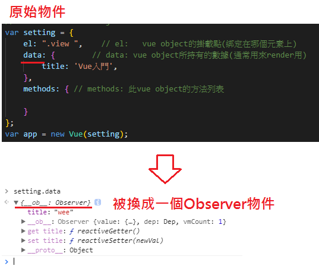

# Vue組件重要選項

## 結構: 傳入Vue物件內的資料結構
1. el (掛載點:元素如何與物件產生關聯的點): template上元素內的class name或id名稱與 Vue Object 的el屬性對應
2. data (數據內容): Vue Object 的**data屬性用來綁定數據到HTML上**,
   Vue會自動監聽data內的數據變化,本值原理是Vue會將data裡面的數據進行遞迴抓取換成getter和setter,然後就可以自動更新HTML標籤(不支援遊覽器getter和setter的遊覽器就悲劇了)
   
3. methods (行為執行): 用來放行為互動的執行方法,提供HTML模板元素事件觸發的行為互動
                      會與HTML的元素綁定
4. computes (計算屬性): 提供HTML模板更簡潔的操作,將HTML模板上的操作轉移至此屬性來使HTML模板更乾淨,computed 的屬性可以被視為像是 data 一樣，可以讀取和設值，因此在 computed 中可以分成 `getter`（讀取） 和 `setter`（設值），在沒有寫 setter 的情況下，computed 預設只有 getter ，也就是只能讀取，不能改變設值。一般是會讓 computed 類似唯讀的狀態，也就是去處理 `data` 資料，然後把它吐出來使用。
  * 預設只有 getter 的 computed
  ```javascript
    new Vue({
        computed: {
            computedData: function () {
                return // ...
            }
        }
    })
  ```

  * 有 setter 和 getter 的 computed
  ```javascript
    new Vue({
        computed: {
            computedData: {
                get: function () {
                    return // ...
                },
                set: function () {
                    // ...
                }
            }
        }
    })
  ```
5. watch (監聽屬性): 用來監聽data內指定屬性的值變化,傳入方法內的是變化前與變化後的值
```javascript
    data: {        // data: vue object所持有的數據(通常用來render用)
             title: 'Vue入門',
             i: 0,
             t: 1
    },
    watch: { // 監聽屬性: 監聽某些值的變化
             i: function(newValue, oldValue) { // 監聽上面 data.i 屬性的變化
                    console.log(`i值變化: ${oldValue} --> ${newValue}`);
            }
    },
```