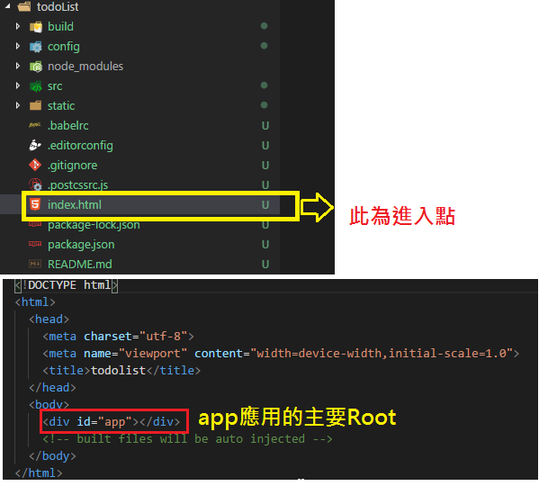

# todo list (練習範例)

## folder structure
1. index.html : Root Page

   

2. **src** 資料夾: 撰寫application的區塊

   

   1. main.js : 此為 **app root**
    ```javascript
      import Vue from 'vue'      // 此行目的是導入Vue組件
      import App from './App'    // 導入當前目錄下的App.vue檔案(副檔名.vue可省略)

      Vue.config.productionTip = false

      /* eslint-disable no-new */
      new Vue({
      el: '#app',
      components: { App },       // 組件必須先註冊後使用
      template: '<App/>'         // 組件的模板名稱
      });
    ``` 
     
     > 執行流程
       
   2. App.vue : 給`vue-loader`轉換用的component

## 改寫原始結構
1. 刪除HelloWorld.vue組件並將`App.vue`組件內的import的HelloWorld組件刪除掉
2. 重新編譯確認todolist 頁面只剩一個logo且console無任何error
3. 在components資料夾內建立一個組件`List.vue`,建立3個區塊標籤分別為 `template` , `script` , `style` 對應的結構分別為 **HTML** , **JavaScript** , **CSS**,
   並在script產生export default輸出Vue物件所須要的 **name** 和 **data** 屬性.
  
> 完成以上就算建立完成一個模組.

## 接下來要將自訂組件渲染至頁面上
1. 在App.vue當中 **導入** `List` 組件並 **註冊** 操作後才能使用`List`組件
   ```javascript
       // 1. 導入組件
       import ListView from './components/List.vue';

       export default {
         name: 'List',
         components: [
           ListView  // 2. 註冊組件
         ]
       }
   ```
   
2. 在App.vue的template(HTML)當中使用組件來渲染至頁面,名稱預設會依據組件名稱的大小寫來當作template內的標籤名稱.
   
   ex: ListView =>  \<list-view /> or \<ListView />
   ```HTML
      <template>
        <!-- 3. 使用組件來渲染至頁面 -->
        <list-view />
      </template>
   ```
## 開始輸入項目列表
1. 在List.vue組件內的 `data` 屬性新增一個屬性 `items` 來存放待辦事項的陣列
   待辦事項應為一個物件且至少有兩個屬性 `text`, `isFinished` 來表示待辦內容和完成狀態. 待辦事項可能為多個,所以可以利用循環渲染`v-for`來渲染至頁面,並在style新增一個class用來當完成時
   ```HTML
    <template>
      <div class="view">
          <h1>{{ title }}</h1>
          <ul>
            <!-- 使用循環渲染來將數據寫至頁面並利用true/false狀態來切換指定class -->
            <li  v-for="item in items" 
                 v-bind:class="{ finish: item.isFinished }">
                 {{ item.text }}
            </li>
          </ul>
      </div>
    </template>
   ```
2. 接下來要新增事件觸發的方法, 所以在 `data` 的 `methods` 屬性新增方法叫 `toggleFinish` 並傳入一個參數為頁面所傳入的 `item` 項目,並在模板上新增event並綁定方法
    ```javascript
      methods: {
            toggleFinish : function (item) {
                console.log('模板頁面傳過來的參數', item);
                // change status
                item.isFinished = !item.isFinished;
            }
        }
    ```
    ```HTML
        <li v-for="item in items" 
            v-bind:class="{ finish: item.isFinished }" 
            @click="toggleFinish(item, $event)">
            {{ item.text }}
        </li>
    ```
3. 新增一個`input`元素來輸入todo內容,並在按下`enter`鍵後就將內容移到todo項目中
   所以使用`@keyup.enter`事件(當按下enter鍵觸發keyup事件)來當做觸發點
   ```HTML
   <!-- input元素負責將todo內容輸出到todo列表 -->
   <input type="text" @keyup.enter="addData" />
   ```
   在 `methods` 區塊新增 `addData` 方法,並將內容傳入新物件並推入todo列表的暫存變量
   ```javascript
        addData(e) {
            console.log('keyup enter event: 新增todo內容至todo列表中', e.target.value);
            this.items.unshift({ 
                text: e.target.value,
                isFinished: false
            });

            // clear input value
            e.target.value = '';
        }
   ```

## 父組件向子組件傳遞參數數據
目前範例的App.vue就是一個父組件,而ListView就是子組件,若父組件向子組件傳遞訊息就涉及通訊問題.
範例: App.vue是父組件, ListView是子組件
組件通信方向: 父組件 --> 子組件  (通過子組件的props屬性完成傳遞)

1. 建立一個子組件 `Header` ,用來當做標題區塊的子組件
2. 在父組件導入並註冊`Header`子組件,再渲染至畫面
3. 開始往子組件傳遞數據
   1. 先在子組件`header`的 `script`區塊新增一個 **props** 屬性
   2. **props** 屬性有很多種寫法, props內可自定義指令物件
      ex: 新增一個`msg`屬性並設為object類型,然後新增一個`type`屬性為 **String** 和 `default`屬性為 "xxxx值", 再將此`msg`屬性渲染到子組件的template上.
      如果父組件還未傳入數據,就會使用剛剛設定的預設值"xxxx值"來渲染至頁面.
      ```HTML
       <template>
            <div class="headerview">
            {{ msg }}
            <!-- msg就像數據顯示一樣渲染到template內 -->
            </div>
        </template>
      ```
      ```javascript
        /* 1. add "props" attribute */
        props:{
            /* 2. add custom directive (msg很像指令也像數據顯示,可以直接插值顯示數據到頁面) */
            msg: {
                type: String, /* 類型為字串 */
                default: '我是域設值'
            }
        }
      ```
   3. 從父組件傳入數據到子組件
      * 在父組件的template上的直接賦值給子組件的`props`內的自定屬性`msg`
      

      * 使用 `v-bind:msg` 指令來綁定子組件的`msg`屬性與父組件的 `parentMsg` 屬性
      


## 子組件傳遞數據給父組件
App.vue是父組件, ListView是子組件
組件通信方向: 子組件 --> 父組件  (通過自定義事件完成傳遞)


1. 子組件透過個觸發方法來發設自定義事件,所以在`addData`使用`this.$emit`方法來將數據傳遞出去給父組件.
   範例: 
   在`ListView`物件的 `addData` 方法
   ```javascript
            // 1. 子組件ListView點擊enter觸發addData方法
            addData(e) {
                let todoContent = e.target.value; //元素的值
                console.log('emitter event object exit?', ('$emit' in this));
                // 2. 將輸入框中輸入值傳遞給父組件App.vue
                //    觸發myMsg事件(自定義事件), 並傳遞參數值
                this.$emit('myMsg', todoContent); // emmit event and passs data to consumer
            }
   ```
2. 在父組件`template`內的ListView組件新增剛剛自訂的事件`myMsg`,
   並設定父組件接收到子組件的emitter所送出的數據時調用的方法`getChildData`
   ```HTML
       <!-- 父組件使用`getChildData`方法來綁定與子組件的關連`myMsg`為子組件自訂事件 -->
       <list-view @myMsg="getChildData" />
   ```
   ```javascript
        methods:{
            getChildData (msg) {
                console.log('App.vue收到子組件ListView傳遞的數據',msg);
            }
        }
   ```
---

## Vue.js的一個組件說明
